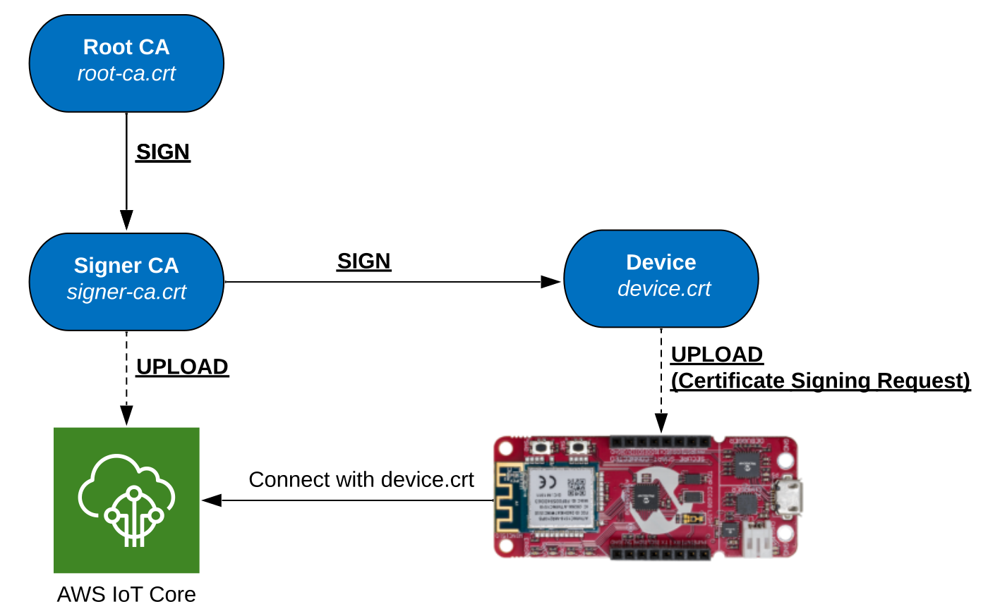
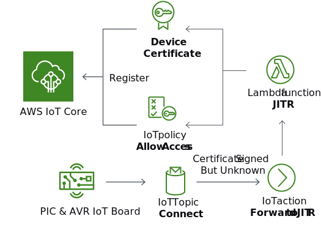
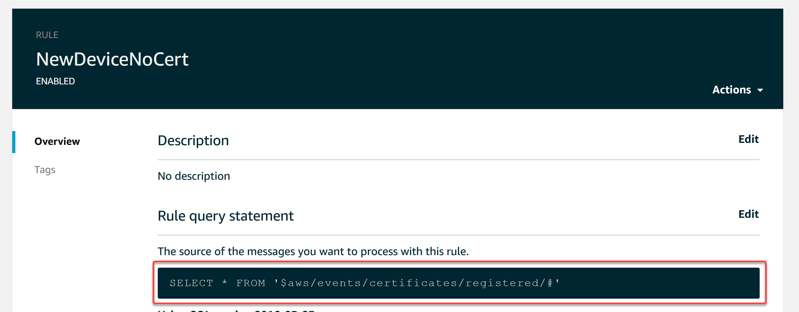

# A More Thorough Look into the Provisioning Process

*Author: Johan Lofstad, Microchip Technology Inc.*

This document is a follow-up of the [Connect the Board to your AWS Account](../Connect%20the%20Board%20to%20your%20AWS%20Account) introductory guide, going into more detail of how the provisioning works. This document is intended for readers who desire to understand how devices are authenticated through JITR and the [IoT Provisioning Tool](https://www.microchip.com/mymicrochip/filehandler.aspx?ddocname=en1001525).

*It is highly recommended to read the [Crash Course in Cryptography and X.509](../Crash%20Course%20in%20Cryptography%20and%20X509) if unfamiliar with X.509 and basic cryptography.*

This document involves the following topics:

- Generating Certificates with the Provisioning Tool

- JITR

- AWS IoT Policies

- Using AWS Lambda and AWS IoT Core to implement JITR

## Table of Contents

- [A More Thorough Look into the Provisioning Process](#a-more-thorough-look-into-the-provisioning-process)
  - [Table of Contents](#table-of-contents)
  - [IoT Provisioning Tool](#iot-provisioning-tool)
    - [Generate and Propagate Certificates](#generate-and-propagate-certificates)
  - [Device Permissions in AWS](#device-permissions-in-aws)
    - [Policy Example](#policy-example)
  - [Just in Time Registration (JITR)](#just-in-time-registration-jitr)
    - [Setting up JITR in AWS](#setting-up-jitr-in-aws)
  - [Finding the AWS Resources](#finding-the-aws-resources)
  - [Next Steps](#next-steps)
  - [Resources](#resources)

## IoT Provisioning Tool

The [IoT Provisioning Tool](http://www.microchip.com/mymicrochip/filehandler.aspx?ddocname=en1001525) is a tool offered by Microchip to easily provision the AWS variant of the PIC & AVR IoT Boards. It handles all the cryptography and interactions with all Microchip PIC & AVR IoT Boards.

The IoT Provisioning Tool is a command-line utility and must be run from a terminal (cmd.exe for Windows®, Terminal for MacOS® & Linux®). The following list contains some use cases for the tool:

- Provision a Board with your own AWS Project: `./iotprovision-bin -c aws -m custom`
- Provision a Board with the AWS Sandbox: `./iotprovision-bin -c aws -m sandbox`
- Provision a Board with a given Firmware: `./iotprovision-bin -c aws -m custom -app myfirm.hex`
- Set Wi-Fi Credentials: `./iotprovision-bin -auth wpa-psk -ssid mywifi -psk password`

> Note: Using the tool is not the only way to install Wi-Fi® credentials and custom firmware. See [AVR-IoT WA Quick Start Guide](http://microchip.com/DS30010218).

For a complete description of what the tool can do, run `./iotprovision-bin --help`. The following is a printout of that command.

```console
user@sys:/provtool$ ./iotprovision-bin --help
usage: iotprovision-bin.exe [-h] [-c {google,aws}] [-A ARCHIVE]
                            [-m {custom,sandbox}] [-a AWS_PROFILE] [-P PORT]
                            [-p PROVISION_FIRMWARE] [-f]
                            [-app APPLICATION_FIRMWARE] [-ssid WIFI_SSID]
                            [-psk WIFI_PSK]
                            [-auth {open,wpa-psk,wep,ieee802.1x}]
                            [-s SERIAL_NUMBER] [--verify]
                            [-l {fatal,error,warning,info,debug}] [-V]
                            [{all,dbgupgrade,certs,provision,links,application,none} [{all,dbgupgrade,certs,provision,links,application,none} ...]]

Provision MCU8 IoT kits for cloud provider

positional arguments:
  {all,dbgupgrade,certs,provision,links,application,none}
                        action(s) to perform (default: all)

optional arguments:
  -h, --help            show this help message and exit
  -c {google,aws}, --cloud-provider {google,aws}
                        Cloud provider to provision for (default: aws)
  -A ARCHIVE, --archive ARCHIVE
                        On-board debugger firmware archive, use bundled file
                        if none specified (default: None)
  -m {custom,sandbox}, --provision-method {custom,sandbox}
                        Provisioning method: Microchip sandbox or custom
                        account (default: sandbox)
  -a AWS_PROFILE, --aws-profile AWS_PROFILE
                        AWS profile name (default: default)
  -P PORT, --port PORT  Kit virtual serial port for provisioning, will try to
                        determine automatically if none specified (default:
                        None)
  -p PROVISION_FIRMWARE, --provision-firmware PROVISION_FIRMWARE
                        Provisioning firmware hex file, use bundled file if
                        none specified (default: None)
  -f, --force           Force provisioning even if already done (default:
                        False)
  -app APPLICATION_FIRMWARE, --application-firmware APPLICATION_FIRMWARE
                        Application/demo firmware hex file, use bundled file
                        if none specified (default: None)
  -ssid WIFI_SSID, --wifi-ssid WIFI_SSID
                        SSID for wifi connection (default: None)
  -psk WIFI_PSK, --wifi-psk WIFI_PSK
                        PSK (password) for wifi connection (default: )
  -auth {open,wpa-psk,wep,ieee802.1x}, --wifi-auth {open,wpa-psk,wep,ieee802.1x}
                        wifi authentication mechanism (default: wpa-psk)
  -s SERIAL_NUMBER, --serial-number SERIAL_NUMBER
                        USB serial number of the unit to provision (default:
                        None)
  --verify              verify after write from file (default: False)
  -l {fatal,error,warning,info,debug}, --logging {fatal,error,warning,info,debug}
                        Logging severity level (default: warning)
  -V, --version         Print iotprovision version number and exit (default:
                        False)
```

### Generate and Propagate Certificates

The *custom* option of the provisioning tool is used to authenticate a board with a non-sandbox AWS project. When running the provisioning tool for the first time using the custom option ( `./iotprovision-bin -c aws -m custom`), the following happens:

1. A *self-signed* **Certificate Authority** (root-ca.crt) is generated. This is the Root CA.

2. A **Signer CA** (signer-ca.crt) is generated and signed by the Root-CA.

3. A **Device Certificate** (device.crt) is generated and signed by the signer certificate.

4. The **Device Certificate** and **Thing Name** is stored in the IoT Board.

5. The **Signer Certificate** is uploaded to AWS IoT as a CA.

Step 3 and 4 are a bit simplified, as in reality, a [*Certificate Signing Request*](https://en.wikipedia.org/wiki/Certificate_signing_request) is performed. All of these certificates and their private keys (except the device certificates) can be found in the folder `.microchip-iot` under the users home directory. See the figure below for an illustration of the generation process.

|OS|Path|
|---|---|
|Windows|%userprofile%\\.microchip-iot|
|Mac and Linux|~/.microchip-iot|



The next time the tool runs, it checks for existing certificates in the `.microchip-iot` folder. If nothing is found, it runs through the process described above. If all certificates exist, it does nothing. If a Root CA and Signer CA exist, but the device is unknown, it signs the connected devices certificate with the Signer CA.

## Device Permissions in AWS

All devices that interact with an AWS account are registered in the IoT Core Module and are called *things*. A thing has a *certificate* attached to it, which again is connected to a *policy*, which defines the certificates permissions and thus also the things permissions. When a device connects, it provides a certificate and a *thing name*. If the thing with the specified name exists and the certificate is valid, the device is allowed to connect and perform the actions specified in the certificates policy.

**Summarized**: Permissions in AWS, such as connect and send data, are defined by a *policy*. Policies are attached to *certificates*, which are used to authenticate *things* (devices).

### Policy Example

Policies are defined as JSON documents, with one or more *statements*. From the AWS Documentation:

> An AWS IoT Core policy is a JSON document that contains one or more policy statements. Each statement contains:
>
> - Effect, which specifies whether the action is allowed or denied
>
> - Action, which specifies the action the policy is allowing or denying
>
> - Resource, which specifies the resource or resources on which the action is allowed or denied
>
> \- [AWS Documentation - AWS IoT Core Policies](https://docs.aws.amazon.com/iot/latest/developerguide/iot-policies.html)

When using the IoT Provisioning Tool, a policy is generated and added based on the project's properties. An example of this policy can be seen in [policy_example.json](policy_example.json).

## Just in Time Registration (JITR)

Just in Time Registration is a provisioning method in which the devices are provisioned the first time they connect. If the device has a certificate signed by the CA in AWS, it is automatically registered with its accompanying certificate. The thing's certificate is also attached to a predefined policy. The provisioning tool automatically configures AWS to use JITR upon initial execution.


### Setting up JITR in AWS

In AWS, JITR functionality can be obtained using an [*AWS Lambda Function*](https://aws.amazon.com/lambda/). A Lambda Function is a code snippet that runs without having dedicated resources. Whenever a call to the function is made, AWS allocates those resources for the duration of the function call. From the AWS Documentation:

> AWS Lambda is a compute service that lets you run code without provisioning or managing servers. AWS Lambda executes your code only when needed and scales automatically, from a few requests per day to thousands per second.
>
> \- [AWS Documentation - What is AWS Lambda?](https://docs.aws.amazon.com/lambda/latest/dg/welcome.html)

A lambda function is precisely what is needed to implement the loop in the figure above. When an unknown device tries to connect using a CA-signed certificate, an MQTT message with the topic `$aws/events/certificates/registered/#` is published. Using an IoT Action (also called rules), these messages are picked up and forwarded to a Lambda Function executing the code found in [jitr_lambda.py](jitr_lambda.py).

> A device is *unknown* if it does not exist in the AWS IoT Thing Registry.

The Lambda Function checks if a policy named `zt_policy` already exists, creating it if not. The devices certificate is linked to the policy and registered in AWS IoT Core. When the devices try to reconnect, it is authenticated. The figure below describes this process.



A screenshot of the *Forward Signed but Unknown Devices* is shown below.



## Finding the AWS Resources

The IoT Provisioning Tool sets up the process described above on initial execution, and the resources it sets up can be found in the AWS Console. The resources can be found in the following locations:

- **Certificate Authority**: IoT Core -> Security -> Certificates
- **Certificates**: IoT Core -> Security -> CAs
- **Policies**: IoT Core -> Security -> Policies
- **Things** (Devices): IoT Core -> Manage -> Things
- **JITR Lambda Function**: Lambda -> JITR

## Next Steps

[](../Your%20First%20Application%20Sending%20and%20Receiving%20Data)

## Resources

- [PIC-IoT WA Development Board Product Page](https://www.microchip.com/DevelopmentTools/ProductDetails/ev54y39a?utm_campaign=IoT-WA-DevBoards&utm_source=GitHub&utm_medium=hyperlink&utm_term=&utm_content=microchip-iot-developer-guide-for-aws-the-provisioning-process)
- [AVR-IoT WA Development Board Product Page](https://www.microchip.com/DevelopmentTools/ProductDetails/ev15r70a?utm_campaign=IoT-WA-DevBoards&utm_source=GitHub&utm_medium=hyperlink&utm_term=&utm_content=microchip-iot-developer-guide-for-aws-the-provisioning-process)
- [IoT Provisioning Tool](https://www.microchip.com/mymicrochip/filehandler.aspx?ddocname=en1001525)
- [AWS Blog on JITR](https://aws.amazon.com/blogs/iot/just-in-time-registration-of-device-certificates-on-aws-iot/)
- [AWS Lambda Function](https://aws.amazon.com/lambda/)
